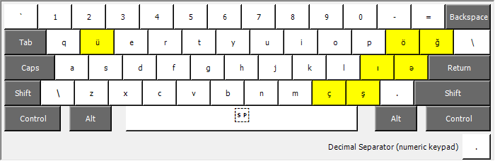
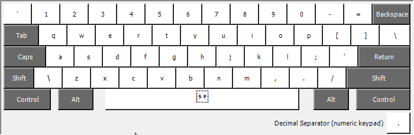
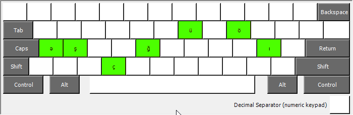

# Azerbaijani (Programmers) Keyboard Layout

This repository contains a custom keyboard layout that integrates English (US) and Azerbaijani (Latin) characters. The motivation for creating this layout is to provide a seamless typing experience for users who frequently switch between these two languages.

## Motivation

Users who are multilingual often face challenges with standard keyboard layouts as they need to switch between different layouts frequently. This custom layout aims to streamline the typing process by combining the necessary characters from two languages into a single layout.

## Purpose

The purpose of this repository is to share the custom keyboard layout with others who might benefit from it. Included in this repository are the necessary binary files to install the layout on a Windows machine.

## Installation

To install the ready to go keyboard layout, run the installer/setup.exe file

## Usage

#### Default
Once installed, you can select the custom keyboard layout from your language settings and use it to type in English and Azerbaijani without having to switch between different layouts.
Just use right `alt` (alt+ctrl) to type azerbaijani characters.
##### Before, switching between US and AZ keyboards:

##### After, no keyboards switching, just use Azerbaijani (Programmers) for both cases:

#### Custom
You can use [Microsoft Keyboard Layout Creator](https://www.microsoft.com/en-us/download/details.aspx?id=102134) to create your own bindings from scratch or modify the current one.

## Contributing

Contributions are welcome! If you have suggestions for improvements or find any issues, please open an issue or submit a pull request.

## License

This project is licensed under the MIT License - see the [LICENSE](LICENSE) file for details.
